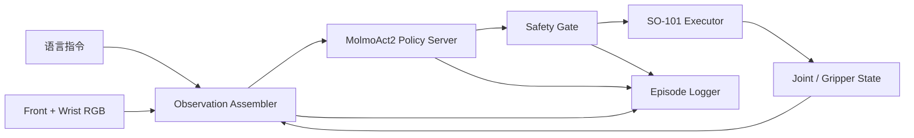

# Document 2 — Technical Design

## 1. 总体架构



MVP 采用 LeRobot/自研 Python 适配层直接闭环，减少 ROS 适配风险；Enhanced 阶段保持相同接口并封装为 ROS 2 节点。

## 2. 模块

| 模块 | 职责 | 来源 |
|---|---|---|
| Camera adapters | 采集、时间戳、颜色空间和分辨率检查 | 自研薄封装 |
| Robot adapter | 读状态、下发动作、连接监测 | LeRobot + 自研 |
| Observation assembler | 严格按 checkpoint 约定排列图像/状态/指令 | 自研 |
| Policy server/client | 加载 MolmoAct2-SO100_101，返回动作块 | 官方 LeRobot/MolmoAct2 + 自研客户端 |
| Action adapter | 反归一化、维度和动作语义检查 | 自研，依据 norm_stats |
| Safety supervisor | 限位、速率、超时、急停、状态机 | 自研 |
| Episode logger | 保存配置、帧、状态、动作、指标、视频 | 自研 |
| Evaluator | 聚合成功率、时延、耗时和失败类型 | 自研 |

## 3. 核心数据契约

### Observation

逻辑结构（字段名最终以实际 LeRobot processor 为准）：

```yaml
timestamp_ns: int64
instruction: string
images:
  front: uint8[H,W,3]   # RGB
  wrist: uint8[H,W,3]
state:
  joints: float32[N]
  gripper: float32[1]
episode_id: string
step_id: int
```

进入模型前必须验证：相机顺序、RGB/BGR、图像尺寸、状态维度、关节顺序、单位、归一化 tag 和缺帧。任何一项不明时禁止驱动真机。

### ActionChunk

```yaml
actions: float32[T,D]
model_latency_ms: float
checkpoint_revision: string
norm_tag: string
```

动作只在 Safety Gate 后进入 Executor。每次最多执行配置的 `n_action_steps`，然后重新观测；初期取较小值，以控制延迟和误差累积，最终值通过实验确定。

### Episode record

```text
runs/<date>/<episode_id>/
  metadata.json
  events.jsonl
  metrics.json
  video_front.mp4
  video_wrist.mp4
```

metadata 必含 git SHA、checkpoint revision、配置哈希、随机种子、硬件版本和测试场景。

## 4. 状态机

`IDLE → ARMED → RUNNING → SUCCESS/FAILED/ABORTED → IDLE`

任何超限、通信超时、图像过期、设备断连或人工急停立即进入 `ABORTED`，停止发送新动作并执行受控停机。

## 5. ROS 2 Enhanced 设计

版本：Ubuntu 24.04 + ROS 2 Jazzy。

| Node | 订阅 | 发布/提供 |
|---|---|---|
| `front_camera_node` | — | `/camera/front/image_raw` |
| `wrist_camera_node` | — | `/camera/wrist/image_raw` |
| `so101_driver` | 安全动作 | `/joint_states`、诊断 |
| `observation_node` | 图像、JointState、指令 | `/policy/observation_status` |
| `molmoact2_client` | 观测就绪事件 | `/policy/raw_action_chunk` |
| `safety_supervisor` | raw actions、JointState | `/robot/safe_action_chunk`、`/safety/events` |
| `episode_logger` | 全部关键 topic | 指标/rosbag2 |
| `task_manager` | 用户请求 | RunTask action/result |

优先使用标准消息：`sensor_msgs/Image`、`sensor_msgs/JointState`、`diagnostic_msgs/DiagnosticArray`、`std_msgs/String/Bool/Float32MultiArray`。稳定后再定义带 shape、timestamp、norm_tag 的自定义消息。

TF：`world → base_link → shoulder_link → ... → gripper_frame`；`base_link → front_camera_link` 为静态变换；`gripper_frame → wrist_camera_link` 为固定安装变换。MVP 的 VLA 不依赖 TF 做控制，但标定与可视化必须记录。

Launch 分组：`bringup.launch.py`、`perception.launch.py`、`policy.launch.py`、`experiment.launch.py`。

## 6. 模型流程

1. 读取 checkpoint 模型卡、`config.json`、`norm_stats.json` 并锁定 revision。
2. 将两路 RGB、语言和机器人状态交给 processor。
3. Molmo2-ER/VLM 生成上下文，flow-matching action expert 生成连续动作块。
4. 动作适配器按对应 norm tag 还原动作。
5. 安全层裁剪/拒绝并执行有限动作步。
6. 重新观测形成闭环。

MVP 不训练。Advanced 优先采用冻结 VLM、训练 action expert；其次 LoRA。是否可在 16 GB 级显存本地训练由 profiling 决定，失败则使用租赁 GPU。

## 7. 仿真到真机

官方 ManiSkill sim_eval 当前主要覆盖 DROID/YAM，并不等价于 SO-101 数字孪生。因此仿真的作用是验证服务器协议、日志和评估框架，不能作为 SO-101 真机成功的证明。

主要 Sim-to-Real 差异：相机视角、光照/材质、关节零位、控制频率、动作范围、夹爪摩擦和延迟。缓解方法是复刻推荐相机布局、固定曝光、校验关节语义、减小动作块、设置软限位，并用真实小范围 dry run 逐步放权。
