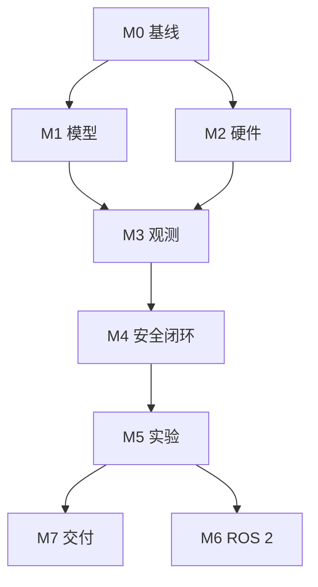

# Document 5 — Implementation Roadmap

## 1. 时间假设

- 每天 08:00–10:00，约 14h/周。
- 12 周，总容量约 168h；按 70% 可计划利用率安排约 118h，其余用于采购等待、调试和生活波动。
- 周 11–12 为缓冲和收尾。
- 高不确定性：SO-101 到货/装配、USB/串口、checkpoint 与具体 SO-101 硬件契约、真机成功率。

## 2. 里程碑

### M0：项目与环境基线（Week 1，10h）

- 目标：冻结需求、上游 revision 和宿主机事实。
- 依赖：无。
- 任务：TASK-001–006。
- 代码：`scripts/diagnostics/`、`tests/smoke/`、配置 schema。
- 交付：环境报告、ADR、锁定策略、smoke tests。
- 验收：GPU/驱动/存储记录完整；测试可重复。
- 常见问题：WSL CUDA/旧 wheel。
- 备选：原生 Ubuntu；重新安装官方 cu128 wheel。

### M1：模型离线 Baseline（Week 2，12h）

- 目标：不连接机器人完成 BF16 模型加载与固定输入推理。
- 依赖：M0。
- 任务：TASK-007、010–014。
- 实现：下载并校验 checkpoint；固定两路样例图和 state；记录 shape、范围、P50/P95、显存。
- 交付：推理脚本、基准 JSON、失败日志。
- 验收：20 次连续请求无进程崩溃；动作契约被显式校验。
- 备选：关闭 CUDA graph、减小并发、使用官方 server；若显存不足转远程推理。

### M2：采购与硬件 bring-up（Week 1–4 并行，18h + 等待）

- 目标：预算内取得并安全驱动 SO-101。
- 依赖：TASK-008 预算审批。
- 任务：TASK-008–009、015–017。
- 实现：BOM 比价、装配、舵机 ID/零位/方向、限位和急停。
- 交付：BOM、照片、校准文件、安全 checklist。
- 验收：低速逐关节测试通过；断连/急停能停止；无模型参与。
- 常见问题：舵机 ID 冲突、供电不足、方向反。
- 备选：逐个舵机隔离诊断；坏件更换；到货延迟时继续 M1/M3。

### M3：视觉与观测管线（Week 4–5，14h）

- 目标：稳定生成模型所需观测。
- 依赖：M1，最好已有机械臂。
- 任务：TASK-018–022。
- 代码：`src/io/cameras.py`、`src/robot/adapter.py`、`src/policy/observation.py`。
- 交付：双相机采集、状态读取、schema validation、录制回放。
- 验收：30 分钟采集无持续掉帧；重启后设备映射稳定；过期观测被拒绝。
- 备选：先单相机接口测试；USB 带宽不足则降低帧率而非静默丢帧。

### M4：安全闭环（Week 6–7，18h）

- 目标：模型动作经安全层驱动真机。
- 依赖：M1–M3。
- 任务：TASK-023–030。
- 代码：policy client、action adapter、safety supervisor、executor、state machine。
- 交付：dry-run、空载、小工作区闭环。
- 验收：所有故障注入测试通过；人工确认后才允许动作；原始动作不可绕过 safety gate。
- 常见问题：动作维度/单位错误、延迟振荡。
- 备选：先只可视化动作；单步执行；缩小动作和工作区。

### M5：MVP 任务与实验（Week 8–9，22h）

- 目标：完成三类真实任务并形成可信结果。
- 依赖：M4。
- 任务：TASK-031–039。
- 代码：任务配置、场景生成、logger、metrics、failure taxonomy。
- 交付：≥60 个正式回合、视频、原始日志、汇总图表。
- 验收：每个预注册回合均有记录；成功标准在测试前冻结；失败不删除。
- 常见问题：抓取末端失败、相机偏移。
- 备选：限制物体集合和初始区域，交付完整但诚实的训练分布内 MVP。

### M6：ROS 2 工程化（Week 10，可推迟，12h）

- 目标：将已验证接口节点化。
- 依赖：M5，不阻塞 MVP。
- 任务：TASK-040–044。
- 交付：launch、topics/actions、diagnostics、rosbag2。
- 验收：Python 直连和 ROS 路线使用同一 schema/safety tests。
- 备选：若时间不足，保留 direct LeRobot pipeline 并发布接口设计。

### M7：交付与 Advanced Gate（Week 11–12，12h）

- 目标：复现、视频、技术总结和是否微调决策。
- 依赖：M5。
- 任务：TASK-045–052。
- 交付：README、架构图、实验报告、Demo、简历草案。
- 验收：干净环境复现；所有陈述能链接到代码/日志。
- 备选：不做微调，集中提升文档与失败分析。

## 3. 周计划

| 周 | 关键目标 | 交付 |
|---:|---|---|
| 1 | M0 + 采购决策 | 环境基线、BOM、锁定版本 |
| 2 | 模型 baseline | 推理日志与资源报告 |
| 3 | 仿真/回放协议 + 等待到货 | 可重复离线 pipeline |
| 4 | 装配和硬件 bring-up | 校准与安全验证 |
| 5 | 双相机和 observation | 录制/回放数据 |
| 6 | action adapter + dry-run | 动作审计报告 |
| 7 | 低速闭环 | 安全闭环证据 |
| 8 | 单物体抓放 | 第一批正式 trials |
| 9 | 目标选择和位置变化 | ≥60 回合数据集 |
| 10 | 鲁棒性或 ROS 2 | 可删减增强项 |
| 11 | Buffer/修复/复现 | release candidate |
| 12 | 视频、报告、简历 | v1.0 交付 |

关键路径：M0→M1→M3→M4→M5→M7。M2 采购与 M1 并行；M6 可推迟；Advanced 不占用 MVP 时间。

## 4. 依赖关系

